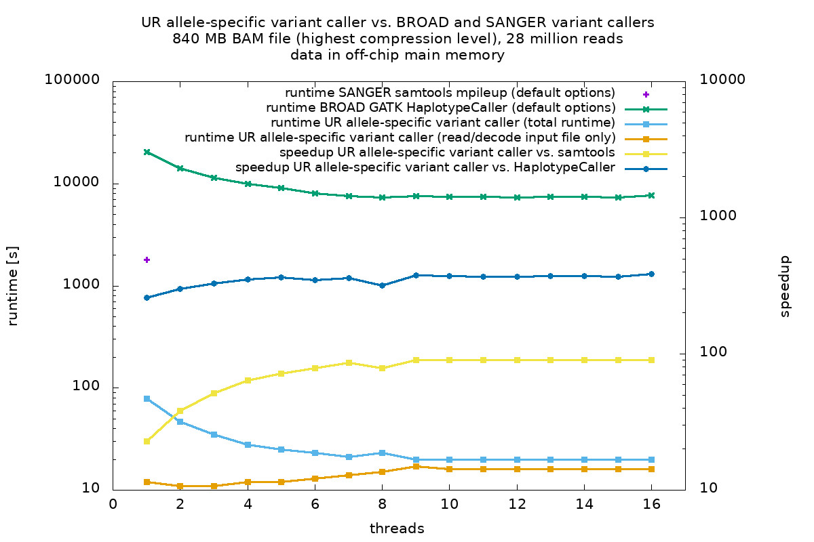

# University of Regensburg allele-specific variant caller

### Synopsis

Variant calling is the process of identifying deviations of aligned reads
from a reference genome.  Heuristics are used to determine the allele
content of the original biological sample.  

The Department of Physics at the University of Regensburg, Germany, is
collaborating with the Fraunhofer Institute for Toxicology and
Experimental Medicine in Regensburg (Fraunhofer ITEM-R), aiming for a novel
sample preparation method for Next Generation Sequencing.  The goal is to
reduce the need for heuristics in variant calling, and to exploit
the benefits of knowledge about the allele content of the sample, e.g.,
* precise determination of the allelic dropout rate,
* precise determination of the copy number,
* allele-specific variant calling (including INDELs).

Special software is necessary in order to take advantage of the novel preparation method.  

License: GPL v3

### Workflow

1. Sample preparation and sequencing (details to be published).
2. Pre-processing of the reads (details to be published).
3. Alignment to a reference genome using, e.g., BWA.  Extraction of
the target region (if necessary).
4. Allele-specific variant calling.

### Run-time comparison

The following figure shows the run-times of popular variant callers
(_BROAD GATK 3.7 HaplotypeCaller_ and _SANGER samtools 1.3.1 mpileup_, both
using heuristics) and the UR allele-specific variant caller
(using the allele content of the sample).  About 28 million short
reads were aligned to a reference genome using BWA and stored in a BAM file.  

The benchmarks were performed on a 8-core Intel Xeon E5-2620v4 server CPU
(2.10 GHz) with AVX2 extensions.  All data were stored in the off-chip main
memory.  Exploiting the inherent parallelism of modern CPU architectures,
such as multi-threading and vectorization, the UR variant caller
processes about 28 million short reads in less than half a minute.
The UR variant caller outperforms GATK by about 400x and samtools by
about 90x in run-time.



### Software requirements

The software is written in C++14 and was tested on various Linux platforms with

* cmake 3.2.2
* zlib 1.2.3
* Eigen 3.3.4
* htslib 1.3.2
* g++ 6 and 7

The clang/LLVM compilers are not recommended.

### Hardware requirements

Supports all x86-64 compliant architectures.

### Build instructions

Modify `cmake-build.sh` according to your setup. Define the paths
to Eigen and htslib, then run
```
cmake-build.sh
```
Run `cmake-clean.sh` for clean-up.

### Usage

Example usage of the variant caller. The output represents a custom
intermediate Variant Calling Format (VCF).
```
ec -i <input BAM file> -f <reference genome in FASTA format> -C dbscan -T
```
Run `ec --help` for further options.
